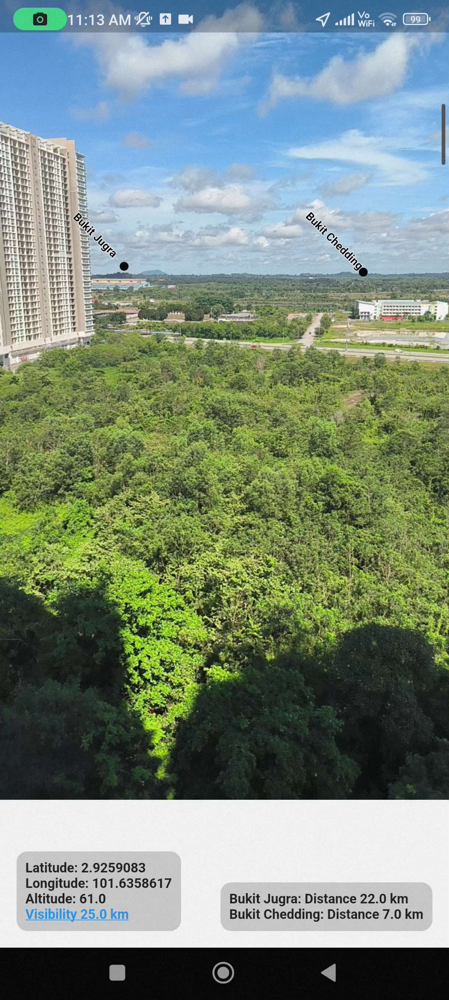
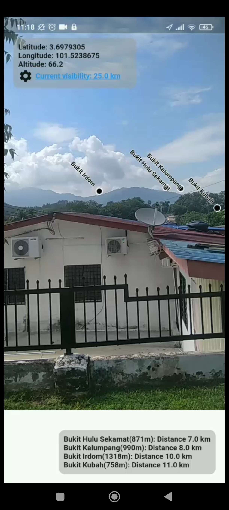

Given latitude and longitude of a location, using perspective projection techniques to convert real world coordinates to pixel coordinates, showing the approximate distance from it to your phone's camera.

## How It Works

1. **Conversion Process**:
   - The world coordinates (latitude, longitude, altitude in WGS84 format) are converted in the following sequence:
     - **WGS84 -> ECEF (Earth-Centered, Earth-Fixed)** 
     - **ECEF -> ENU (East-North-Up)**
   - These conversions are handled in Java, using Android's Camera2 API for intrinsic values and sensor data for camera orientation. Communication between Flutter and Java is established using `MethodChannel`.

2. **Perspective Projection**:
   - The ENU coordinates are transformed to the phone’s camera frame of reference using a perspective projection matrix. This matrix incorporates:
     - **Camera intrinsic values** (focal length, principal points, skew, etc.).
     - **Orientation sensors** for camera rotation.
   - The resulting screen coordinates represent the location’s position on the phone’s display.

## Required Parameters

Required parameters:
1. **Camera Orientation Sensors**: Data from the gyroscope and accelerometer to determine the phone's orientation in space.
2. **Camera Intrinsic Values**: Obtained using the Android Camera2 API, including focal lengths, principal point offsets, and aspect ratio.
3. **ENU Coordinates**: Calculated from the input latitude and longitude (WGS84) after transformation to ECEF format.

WSG84 data are sent through MethodChannel to Java, where conversions are done then is sent back to Flutter

